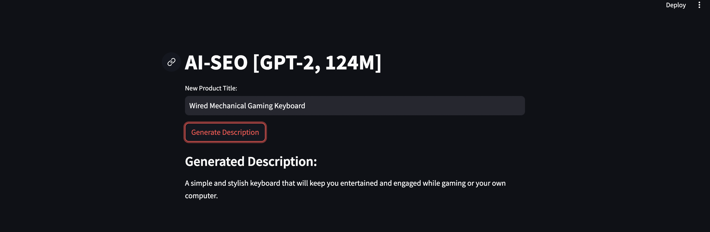

# AI-Powered Product Description Generator

Enhance your e-commerce success with our state-of-the-art service, leveraging OpenAI's GPT-2 model to automatically generate SEO-optimized product descriptions. This innovative tool helps our partners (sellers on our marketplace) create captivating and keyword-rich product descriptions that attract traffic and boost sales.

## Key Features

- **AI-Driven Creativity**: Harness the power of GPT-2 to create unique and engaging product descriptions that stand out from the competition.
- **SEO Optimization**: Generate descriptions optimized for search engines, helping your products rank higher and attract more customers.
- **Simple Input**: Just enter the product name as a prompt, and our service will generate a detailed and optimized product description.
- **Batch Processing**: Efficiently handle large catalogs with the ability to generate multiple descriptions simultaneously, saving time and effort.
- **Seamless Integration**: Easily integrate the service into your existing e-commerce platform via API or use it as a standalone application.
- **User-Friendly Interface**: Enjoy a simple and intuitive interface that allows users to generate product descriptions effortlessly, without needing technical expertise.

## How It Works

1. **Enter Product Name**: Provide the product name as a prompt.
2. **Generate Description**: Our service uses the prompt to automatically create an SEO-optimized product description.
3. **Boost Visibility**: Use the generated description to enhance your product listings and improve search engine rankings.

## Usage

1. **Build image from Dockerfile**:
    ```sh
    docker build -t product-description-generator .
    ```

2. **Run a container:**
   ```
   docker run -p 8501:8501 product-description-generator
   ```

